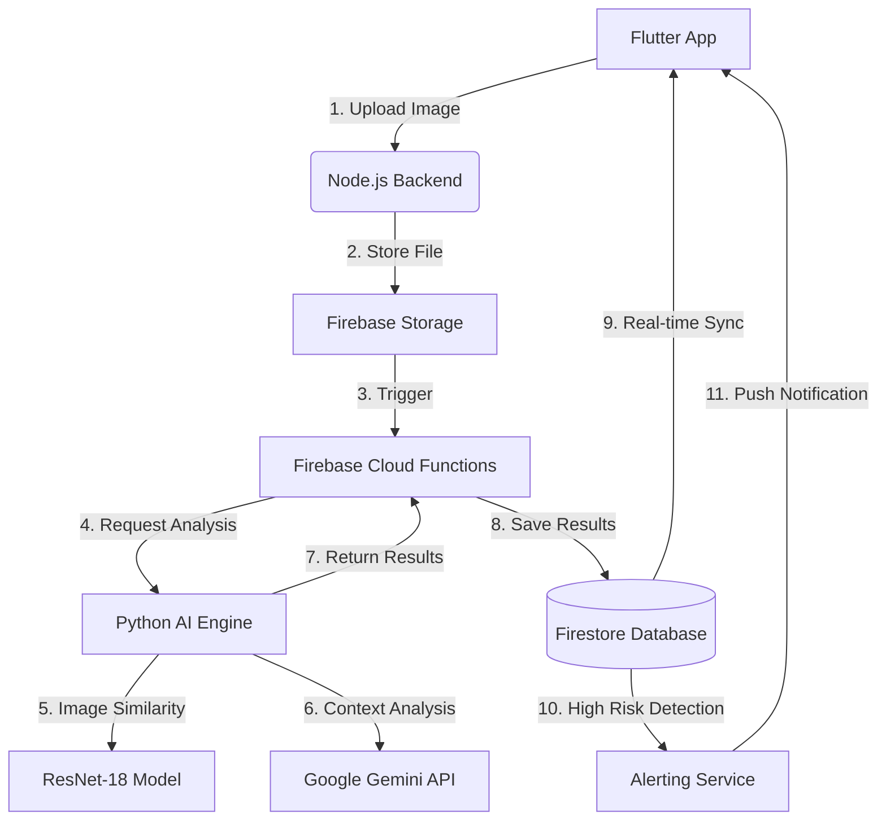

# System Architecture

The AI Digital Shadow Tracker is built on a distributed, event-driven architecture that combines cross-platform mobile tech, Node.js scalability, and specialized Python AI modules.

## High-Level Workflow

## Component Breakdown

### 1. Frontend (Flutter)
- **Role**: User interface and real-time monitoring.
- **Key Features**: Image selection, Dashboard visualizations, Push notifications.

### 2. API Gateway (Node.js/Express)
- **Role**: Secure entry point and file handling.
- **Key Features**: Multer integration, Firebase Admin SDK, Auth management.

### 3. AI Intelligence (Python)
- **Role**: Heavy lifting for similarity and reasoning.
- **Key Features**: 
    - **Feature Extraction**: PyTorch/ResNet for visual signatures.
    - **NLP**: Sentence Transformers for text semantics.
    - **LLM**: Google Gemini 1.5 Flash for human-like risk assessment.

### 4. Cloud Automation (Firebase)
- **Role**: Event-driven automation.
- **Key Features**: Cloud Functions (Storage/Firestore triggers), Firestore (NoSQL), Cloud Storage.
